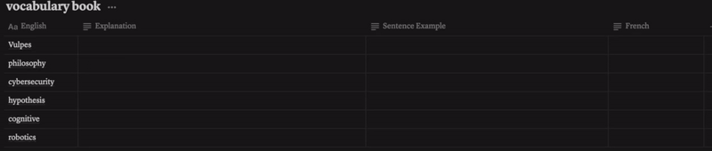

# Notiollama
**Notiollama**  is an automation workflow that updates a `Notion` database with content generated by `Ollama`, leveraging locally deployed AI models.

## Example
\
A use case for language learning is the **Smart Vocabulary Book**, which automatically integrates translations, explanations, and example sentences for newly added words.

## Requirements

- Python
- A locally deployed language model via Ollama
- Notion API access

## Installation

1. Clone the repository:

   ```sh
   git clone https://github.com/your-repo/Notiollama.git
   cd Notiollama
   ```

2. Install dependencies:

   ```sh
   pip install -r requirements.txt
   ```
4. Ollama
   - Install Ollama: [Guide](https://ollama.com/download)
   - Download a language model
   ```sh
   ollama run llama3
   ```

4. Configure Notion API:

   - Create a Notion Integration: [Guide](https://developers.notion.com/docs/create-a-notion-integration#create-your-integration-in-notion)
   - Retrieve your Notion API key: [Guide](https://developers.notion.com/docs/create-a-notion-integration#get-your-api-secret)
   - Share your database with the integration: [Guide](https://developers.notion.com/docs/create-a-notion-integration#give-your-integration-page-permissions)
   - Know your database ID: [Guide](https://developers.notion.com/reference/retrieve-a-database)

5. Update the `config.txt` file with:

   ```
   NOTION_API_KEY=your_notion_api_key
   NOTION_DATABASE_ID=your_database_id
   OLLAMA_API_URL=http://localhost:11434/api/generate
   OLLAMA_MODEL=your_model (e.g. llama3)
   ```

## Usage

Run the script to update your Notion database with AI-generated sentence examples:

```sh
python demo_translation.py
```

## Modules

- `notion_api.py`: Handles Notion API interactions.
- `ollama_api.py`: Calls the locally deployed AI model.
- `config.py`: Loads API keys and configurations.


## Issues and Features

Feedback and suggestions for new features are welcome.
>Tell me and I forget. Teach me and I remember. Involve me and I learn.

## Future Work
- Extend support for multi-modal inputs (e.g., text and images).  
- Error handling and logging.

## License

MIT License

